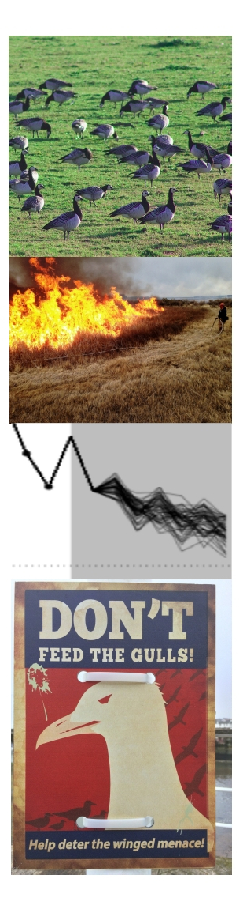
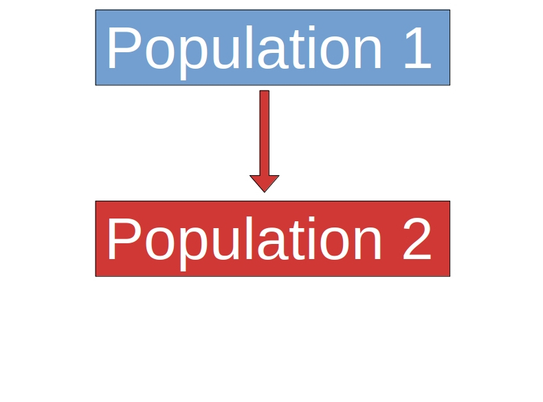
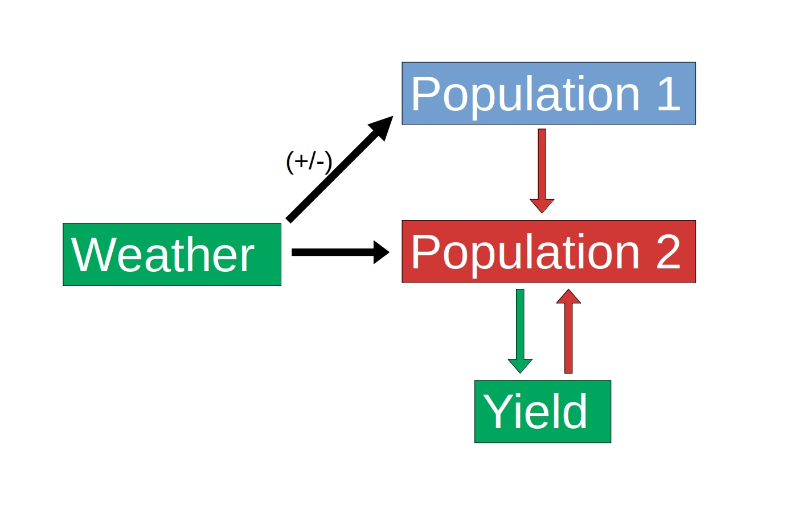
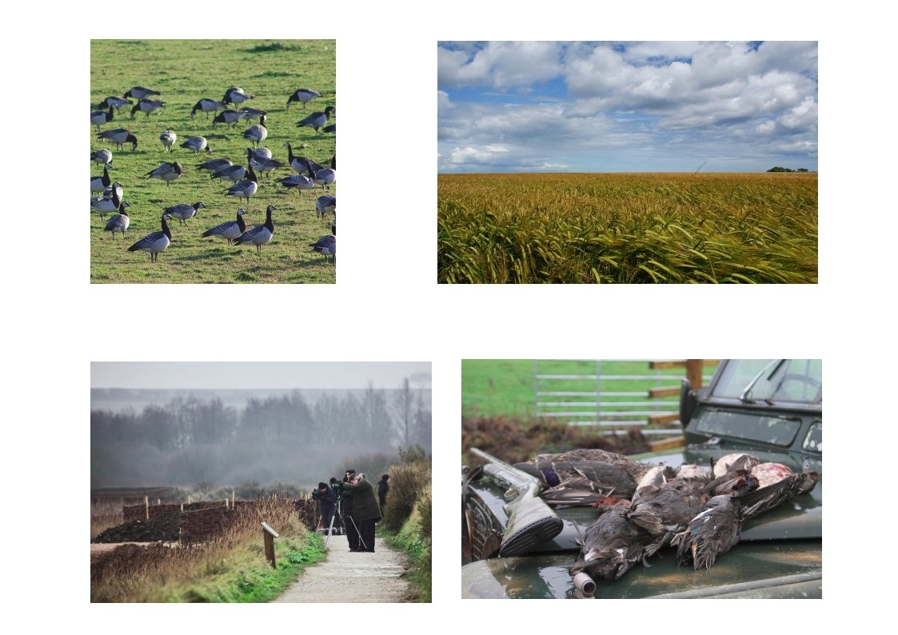
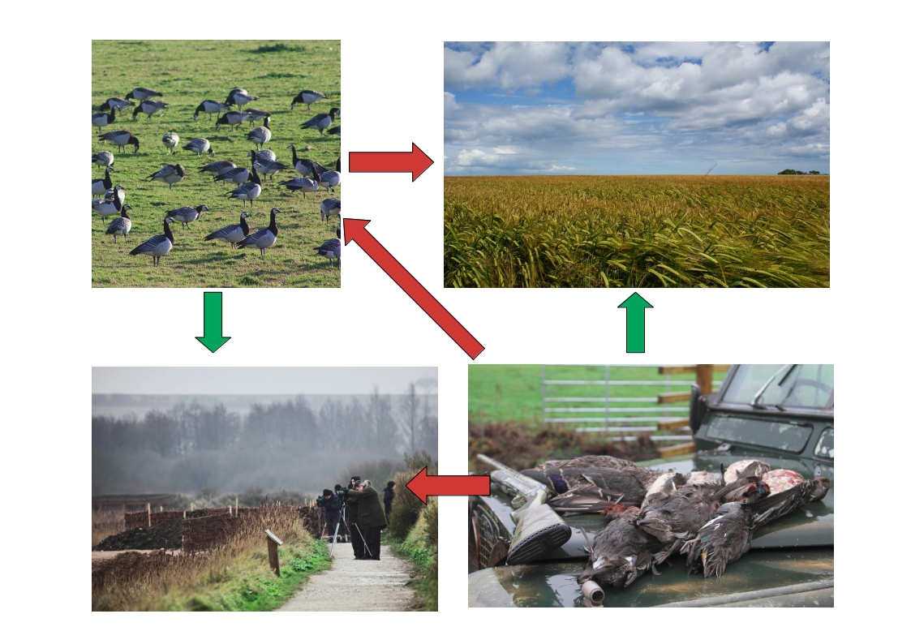
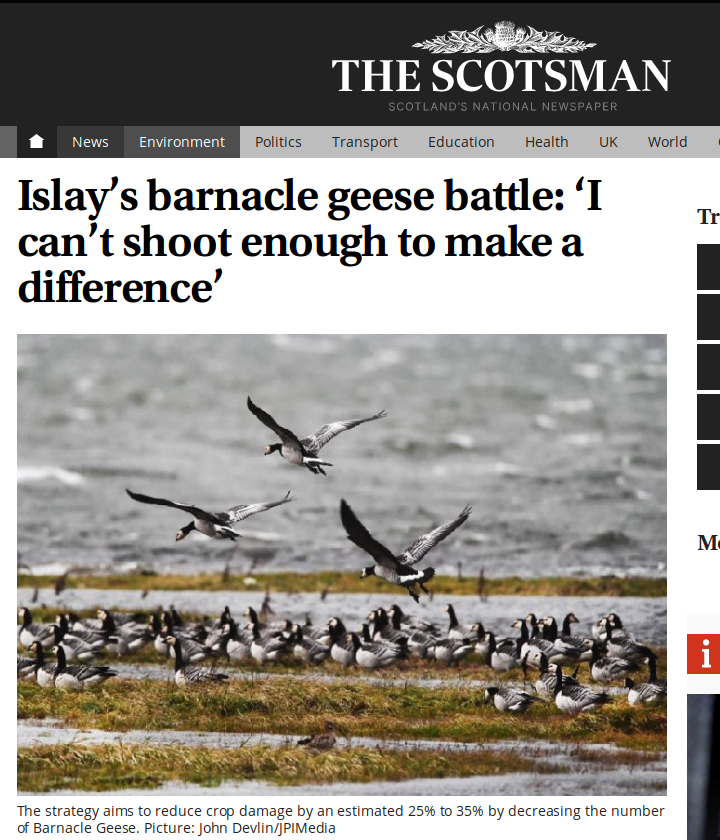
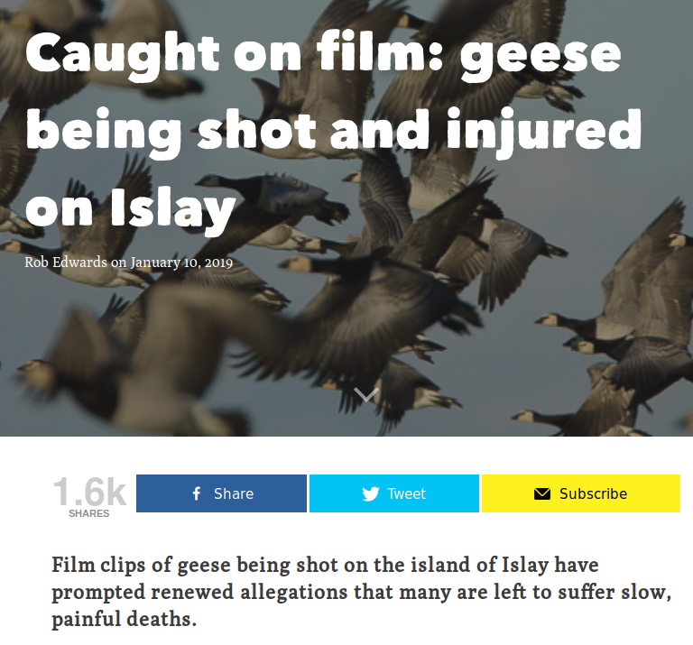

``` {r echo=FALSE}
library(knitr)
```

# Overview

.left-column[
  ```{r, out.width = "90%", echo=FALSE}

```
]

.right-column[

- Why model?

- Types of model
  - Conceptual
  - Mechanistic models
  - Simulation models
- Examples in conservation/population management

- Tea break!

- Discussions/excercises

]

---

# Conceptual models

.pull-left[
  
  
]
.pull-right[

- State variables  
  Represent condition/state, e.g.
  - Population size
  - Stakeholder response
  
- Relationships  
  Represent relationships or effects, e.g.
  - Effect of predation
  - Management effects
]

---

# Why modelling? Management complexity

.pull-left[

]

--

.pull-right[
``` {r, echo=FALSE, fig.retina=3}
goose <- read.csv('~/Dropbox/Islay_goose_data_from_Tom_Jan_2018/Population counts/Barnacle_goose_Islay_monthly_counts_1987-2015.csv')
barplot(tapply(goose$mean.count, goose$year, mean), ylab='Mean winter count', 
        xlab='Year', main='Islay barnacle goose counts', col='darkgreen')
```
]

---

# Why modelling? Management complexity


---

# Why modelling? Management complexity


---

# Conservation conflicts

.pull-left[
  
[The Scotsman](https://www.scotsman.com/news/environment/islay-s-barnacle-geese-battle-i-can-t-shoot-enough-to-make-a-difference-1-4831537), November 2018

]

--

.pull-right[
  
[theferret.scot](https://theferret.scot/film-geese-shot-injured-islay/), January 2019
]

---
layout: false
.left-column[
  ## What is it?
]
.right-column[
  A simple, in-browser, Markdown-driven slideshow tool targeted at people who know their way around HTML and CSS, featuring:

- Markdown formatting, with smart extensions

....
]

---
.left-column[
  ## What is it?
  ## Why use it?
]
.right-column[
If your ideal slideshow creation workflow contains any of the following steps:

- Just write what's on your mind

....
]

---
.left-column[
  ## What is it?
  ## Why use it?
]
.right-column[
As the slideshow is expressed using Markdown, you may:

- Focus on the content, expressing yourself in next to plain text not worrying what flashy graphics and disturbing effects to put where

....
]

