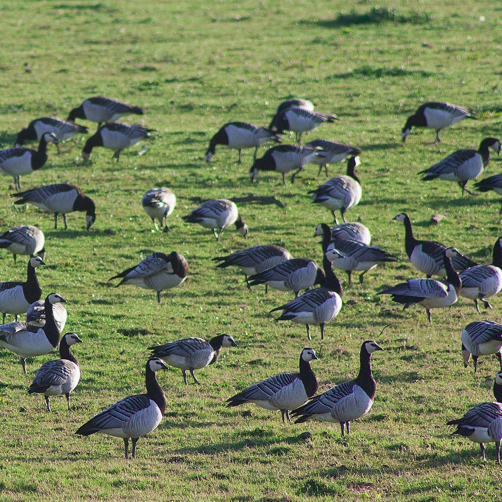

``` {r echo=FALSE}
library(knitr)
source('lgFunc.r')

```

# Overview

.left-column[
  ```{r, out.width = "90%", echo=FALSE}

```
]

.right-column[

- What and why?

{{content}}

]

--

- Types of model
{{content}}

--

  + Conceptual
  {{content}}
--
  + Quantitative models
  {{content}}
--
  + Individual-based models (simulation)
{{content}}

--

- Example: oystercatcher IBM

{{content}}

--

- Modelling process: steps and complexity

{{content}}

--

- Tea break!

{{content}}

--

- Excercises & discussion

{{content}}

---

# Why modelling?

## What is it anyway?

### Definitions?

{{content}}
--
  "*a <span style="color:blue">representation</span> of a particular thing, idea, or <span style="color:blue">condition</span>.. can be as simple as a verbal statement about a subject, or two boxes connected by an arrow to represent <span style="color:blue">some relationship</span>.*" [(Jackson et al 2000)](https://academic.oup.com/bioscience/article/50/8/694/243278)

{{content}}

--

"*Models represent real world phenomena in <span style="color:blue">simplified forms</span> in order to <span style="color:blue">generate understanding</span> of those phenomena; in ecology, models are typically <span style="color:blue">mathematical objects</span>*" [(Evans 2012)](https://www.ncbi.nlm.nih.gov/pmc/articles/PMC3223798/)

---

# Why modelling?

## What is it anyway?

.left-column[
```{r, out.width = "90%", echo=FALSE}

```
```{r, out.width = "90%", echo=FALSE}
include_graphics("pics/nicholson_etal_projection.png")
```
```{r, out.width = "90%", echo=FALSE}
include_graphics("pics/fryxell_et_al_small.png")
```

]
.right-column[
### Examples illustrate different purposes
{{content}}
]
--

- **Predicting** animal distributions and/or population dynamics following disturbance or management interventions (e.g. [Stillman et al. 2001](https://besjournals.onlinelibrary.wiley.com/doi/abs/10.1046/j.1365-2664.2001.00644.x), [Nabe-Nielsen et al. 2014](http://www.sciencedirect.com/science/article/pii/S0304380013004675))
{{content}}
--

- **Evaluating** effect of policy interventions on species conservation (e.g. [Nicholson et al. 2019](https://linkinghub.elsevier.com/retrieve/pii/S0169534718302519))
{{content}}
--

- **Understanding** effect of delayed management responses (e.g. [Fryxell et al. 2010](http://www.sciencemag.org/cgi/doi/10.1126/science.1185802))
]

---

# Why modelling? Evaluation and uncertainty

.left-column[
```{r, out.width = "100%", echo=FALSE}
include_graphics("pics/strategic-plan.png")
```
```{r, out.width = "100%", echo=FALSE}

```

]

.right-column[

### The Aichi Biodiversity Targets 
Convention on Biological Diversity, e.g...
{{content}}
]
--
- **Target 12**: "*By 2020 the <span style="color:blue">extinction of known threatened species has been prevented</span> and their conservation status, particularly of those most in decline, has been improved and sustained.*"
{{content}}
--
- **Target 14**: "*By 2020, <span style="color:blue">ecosystems that provide essential services</span>, including services related to water, and contribute to health, livelihoods and well-being, are <span style="color:blue">restored and safeguarded</span>, taking into account the needs of women, indigenous and local communities, and the poor and vulnerable.*"

---

# Why modelling? Evaluation and uncertainty

### Scenarios and Models to Support Global Conservation Targets ([Nicholson et al. 2019](https://linkinghub.elsevier.com/retrieve/pii/S0169534718302519))

.pull-left[
```{r, out.width = "100%", echo=FALSE}
include_graphics("pics/Nicholson et al 2019_fig1.jpg")
```
]

.pull-right[
- Targets can shape policy and action...  
{{content}}
]
--
- ... **BUT** bad wording or poor understanding can lead to poor conservation outcomes
{{content}}
--
- Model <span style="color:blue">predictions may help evaluate possible outcomes</span> (scenarios)
{{content}}
--
- Facilitates systematic use of <span style="color:blue">data</span> & representation of <span style="color:blue">uncertainty</span>

???

(Top left)
- Trend data and indicators in black. This could be for example the number of threatened species or population trends of a selection of species of concern.
(Top right)
- Scenarios are model predictions based on a given set of alternative circumstances. This can play a part in not just agenda setting but also phrasing of the targets themselves, to make sure they are achievable. In this plot, the target level of a given indicator is represented by the red line, and the different scenarios in red - for example a "business as usual" scenario where nothing is done (purple), or alternative strategies in green and blue. 
(Bottom figures)
This is a specific example of how models and scenarios could contribute to one of the Aichi targets, target 12 - no further decrease in the number of threatened species as indicated by the Red List Index.
The first figure represents a statistical model that would just be an extrapolation of a past trend into the future, showing the target is unlikely to be met.
The second (bottom left) shows a similar sort of review but compared to a counterfactual in orange, that is, a situation where the current decline of species threat status is compared to a situation where nothing had been done - showing we are overall better off.
In addition, and perhaps more interestingly, alternative ways in which models and scenarios derived from models could be used, is by comparing different policy implementations 

---

# Why modelling? Management complexity

.pull-left[

]

--

.pull-right[
``` {r, echo=FALSE, fig.retina=3}
goose <- read.csv('~/Dropbox/Islay_goose_data_from_Tom_Jan_2018/Population counts/Barnacle_goose_Islay_monthly_counts_1987-2015.csv')
barplot(tapply(goose$mean.count, goose$year, mean), ylab='Mean winter count', 
        xlab='Year', main='Islay barnacle goose counts', col='darkgreen')
```
]

---

# Why modelling? Management complexity


---

# Why modelling? Management complexity


---

# Why modelling? Management complexity

.pull-left[
  
[The Scotsman](https://www.scotsman.com/news/environment/islay-s-barnacle-geese-battle-i-can-t-shoot-enough-to-make-a-difference-1-4831537), November 2018

]

--

.pull-right[
  
[theferret.scot](https://theferret.scot/film-geese-shot-injured-islay/), January 2019
]

---

# We're all modellers! (sort of)
--
.pull-left[
```{r echo=FALSE}
example_data <- data.frame(Obs=c(1:1000),N=rpois(1000,100))
hist(example_data$N, col='grey', ylab='', xlab='N', main='Histogram of N', cex.axis=2, cex.lab=2)
ndata <- rnorm(10000, 100, 10)
f <- 200/max(density(ndata)$y)
lines(density(ndata)$x, density(ndata)$y*f, col='red', lwd=2)
abline(v=mean(example_data$N), col='red', lwd=3, lty='dashed')
```
``` {r eval=FALSE}
N = rpois(1000, 100) # Sample counts
rnorm(10000, 100, 10) # Normal distribution
```
]
--
.pull-right[

- A mean of *N* is a model!

- Makes assumptions

- "Predicts" the most likely "true" value, given assumptions hold

]


---

# Conceptual models

.pull-left[
  
  
]
.pull-right[

- **State variables**  
{{content}}
]
--
  Represent condition/state, e.g.
  
{{content}}
--
  - Population size
  - Stakeholder response
{{content}}
--


- **Relationships**  
{{content}}
--
  Represent relationships or effects, e.g.
  
{{content}}
--
  - Effect of predation
  - Management effects


---

# Conceptual models

.pull-left[
  
  
]
.pull-right[

- **Advantages**

{{content}}
]
--
  + Easy to understand and to communicate
{{content}}
--
  + Very flexible and quick to develop
{{content}}
--
  + Useful tool for planning/designing work
{{content}}
--

- **Disadvantages**

{{content}}
--
  + Not usually quantitative
{{content}}
--
  + Can be deceptively simple
{{content}}


---

# Quantitative models

## Logistic population growth model

.pull-left[
``` {r echo=FALSE}
r1 <- 1.5
K1 <- 100
t1 <- seq(0,6,0.1)
N_t1 <- lgFunc(K=K1, N0=10, r=r1, t=t1)
plot(t1, N_t1, type='l', xlab='t', ylab='N', cex.axis=1.5, cex.lab=1.5, lwd=2, ylim=c(0,150))
text(x=1, y=140, paste("K =",K1), cex=2)
text(x=1, y=125, paste("r =",r1), cex=2)

```
]

.pull-right[
  
$\frac{dN}{dt}=rN\Big(1-\frac{N}{K}\Big)$

$N(t) = \frac{KN_0}{(K-N_0)e^{-rt}+N_0}$

{{content}}
]
--
- N(t) = population size at time *t*
{{content}}
--
- N<sub>0</sub> = initial population size
{{content}}
--
- r = intrinsic population growth rate
{{content}}
--
- K = carrying capacity


---

# Quantitative models

## Logistic population growth model

.pull-left[
``` {r echo=FALSE}
r1 <- 1.5
K2 <- 140
t1 <- seq(0,6,0.1)
N_t2 <- lgFunc(K=K2, N0=10, r=r1, t=t1)
plot(t1, N_t2, type='l', xlab='t', ylab='N', cex.axis=1.5, cex.lab=1.5, lwd=2, ylim=c(0,150))
text(x=1, y=140, paste("K =",K2), cex=2)
text(x=1, y=125, paste("r =",r1), cex=2)
```
]

.pull-right[
  
$\frac{dN}{dt}=rN\Big(1-\frac{N}{K}\Big)$

$N(t) = \frac{KN_0}{(K-N_0)e^{-rt}+N_0}$

- N(t) = population size at time *t*
- N<sub>0</sub> = initial population size
- r = intrinsic population growth rate
- K = carrying capacity

]

---

# Quantitative models
  
## Logistic population growth model

.pull-left[
``` {r echo=FALSE}
r2 <- 0.75
K2 <- 140
t1 <- seq(0,6,0.1)
N_t2 <- lgFunc(K=K2, N0=10, r=r2, t=t1)
plot(t1, N_t2, type='l', xlab='t', ylab='N', cex.axis=1.5, cex.lab=1.5, lwd=2, ylim=c(0,150))
text(x=1, y=140, paste("K =",K2), cex=2)
text(x=1, y=125, paste("r =",r2), cex=2)
```
]

.pull-right[
  
$\frac{dN}{dt}=rN\Big(1-\frac{N}{K}\Big)$

$N(t) = \frac{KN_0}{(K-N_0)e^{-rt}+N_0}$

- N(t) = population size at time *t*
- N<sub>0</sub> = initial population size
- r = intrinsic population growth rate
- K = carrying capacity

]

---

# Quantitative models

## Logistic population growth model

.pull-left[
``` {r echo=FALSE}
r2 <- 0.75
K2 <- 140
t1 <- seq(0,6,0.1)
N_t2 <- lgFunc(K=K2, N0=10, r=r2, t=t1)
plot(t1, N_t2, type='l', xlab='t', ylab='N', cex.axis=1.5, cex.lab=1.5, lwd=2, ylim=c(0,150))
text(x=1, y=140, paste("K =",K2), cex=2)
text(x=1, y=125, paste("r =",r2), cex=2)
```
]

.pull-right[
  
**Advantages**
{{content}}
]
--
- Basic quantitative models very simple
{{content}}
--
- Relatively easy to fit to data  
{{content}}
--

**Disadvantages**
{{content}}
--
- N function of only one "explanatory variable"
{{content}}
--
- Expanding explanatory variables can require significant maths skills
{{content}}
--
- Difficult to extrapolate beyond parameterised range
{{content}}
--


---

# Quantitative models

## More realism?
Effects of noise and by-catch on a Danish harbour porpoise population (Nabe-Nielsen et al. 2014)


- Needs understanding of maths
- Not easy to communicate to non-specialists
- Usually very specific to case study

---

# Quantitative models

## More realism?
Effect of marine reserve establishment on non-cooperative fisheries management (Takashina *et al*. 2017)

.pull-left[
  
  
  
  
  
]

.pull-right[
```{r, echo = FALSE, out.width = "250px", fig.align='center'}
knitr::include_graphics("pics/fisheries.png")
```

- Increased realism = increased complexity
- Hard to communicate?
- Needs extensive technical skills to implement

]

---

# Individual-based models

### IBMs, "Agent-based" models

```{r, echo = FALSE, fig.align='default', out.width = "40%"}

```
```{r, echo = FALSE, fig.align='default', out.width = "40%"}

```

---

# Individual-based models

```{r, echo = FALSE, fig.align='default', out.width = "90%"}

```

---

# Individual-based models

```{r, echo = FALSE, fig.align='default', out.width = "90%"}

```

---

# Individual-based models

```{r, echo = FALSE, fig.align='default', out.width = "90%"}

```

---

# Individual-based models

Based around **two key principles** (per [Stillman et al. 2015](http://academic.oup.com/bioscience/article/65/2/140/2754218/Making-Predictions-in-a-Changing-World-The))

{{content}}

```{r, echo = FALSE, fig.align='center', out.width = "50%"}

``` 
--

**1. Emergence**
  - Population properties arise from individuals:
  - e.g. behaviour, physiology, genotype

{{content}}
--

**2. Fitness**
  - Individual fitness determines success (survival/reproduction)
  - Individuals aim to maximise fitness
  - Fitness & environment linked by functions

---

# Individual-based models: Oystercatchers

IBM to predict winter mortality in Oystercatchers (*Haematopus ostralegus*)
.center[([Stillman et al. 2000](https://besjournals.onlinelibrary.wiley.com/doi/abs/10.1046/j.1365-2664.2000.00506.x))]
```{r, echo = FALSE, fig.align='center', out.width = "85%"}
knitr::include_graphics("pics/Stillman_model_3.jpg")
``` 

---

# Individual-based models: Oystercatchers

IBM to predict winter mortality in Oystercatchers (*Haematopus ostralegus*)
.center[([Stillman et al. 2000](https://besjournals.onlinelibrary.wiley.com/doi/abs/10.1046/j.1365-2664.2000.00506.x))]
```{r, echo = FALSE, fig.align='center', out.width = "85%"}

``` 

---

# Individual-based models: Oystercatchers

IBM to predict winter mortality in Oystercatchers (*Haematopus ostralegus*)
.center[([Stillman et al. 2000](https://besjournals.onlinelibrary.wiley.com/doi/abs/10.1046/j.1365-2664.2000.00506.x))]
```{r, echo = FALSE, fig.align='center', out.width = "85%"}

``` 

---

# Individual-based models: Oystercatchers

IBM to predict winter mortality in Oystercatchers (*Haematopus ostralegus*)
.center[([Stillman et al. 2000](https://besjournals.onlinelibrary.wiley.com/doi/abs/10.1046/j.1365-2664.2000.00506.x))]
```{r, echo = FALSE, fig.align='center', out.width = "85%"}

``` 

---

# Individual-based models: Oystercatchers

IBM to predict winter mortality in Oystercatchers (*Haematopus ostralegus*)
.center[([Stillman et al. 2000](https://besjournals.onlinelibrary.wiley.com/doi/abs/10.1046/j.1365-2664.2000.00506.x))]
```{r, echo = FALSE, fig.align='center', out.width = "85%"}

``` 

---

# Individual-based models: Oystercatchers

IBM to predict winter mortality in Oystercatchers (*Haematopus ostralegus*)
.center[([Stillman et al. 2000](https://besjournals.onlinelibrary.wiley.com/doi/abs/10.1046/j.1365-2664.2000.00506.x))]
```{r, echo = FALSE, fig.align='center', out.width = "85%"}

``` 

---

# Individual-based models: Oystercatchers

IBM to predict winter mortality in Oystercatchers (*Haematopus ostralegus*)
.center[([Stillman et al. 2000](https://besjournals.onlinelibrary.wiley.com/doi/abs/10.1046/j.1365-2664.2000.00506.x))]
```{r, echo = FALSE, fig.align='center', out.width = "85%"}

``` 

---

# Individual-based models: Oystercatchers

### Model validation ([Stillman et al. 2000](https://besjournals.onlinelibrary.wiley.com/doi/abs/10.1046/j.1365-2664.2000.00506.x))

.pull-left[
### Intake rate predictions
```{r, echo = FALSE, fig.align='center', out.width = "85%"}
knitr::include_graphics("pics/Stillman2000_8.jpg")
``` 
]

.pull-right[
### Mortality predictions
```{r, echo = FALSE, fig.align='center', out.width = "75%"}

``` 
```{r, echo = FALSE, fig.align='center', out.width = "75%"}

``` 

]

---

# Individual-based models: Oystercatchers

### IBM assessing effects of disturbance ([West et al. 2000](http://www.sciencedirect.com/science/article/pii/S0006320701002579))

Disturbance scenarios on feeding areas: (a) 10% of area; (b) 50% of area

```{r, echo = FALSE, fig.align='center', out.width = "100%"}

``` 

```{r, echo = FALSE, fig.align='center', out.width = "50%"}

``` 


---

# Individual-based models

.pull-left[
### Individual-based models
- Usually need fewer historical population data.
- Fitness maximisation likely to hold in future - extrapolation possible
- Individual variability implicitly accounted for.
- Needs data on and understanding of behaviour
- Quickly becomes very complex
]
--
.pull-right[
### Population-level models
- Usually needs more historical data to "fit"
- Limited extrapolative power
- "Tyranny of the mean"
- No need for individual-level data
- Basic forms easy to build "out of the box"
]

```{r, echo = FALSE, fig.align="center", fig.show = "hold", out.width = "80%",}

``` 

---

# Modelling process

### The modelling cycle ([Schmolke *et al.* 2010](https://linkinghub.elsevier.com/retrieve/pii/S016953471000100X))
  
```{r, echo = FALSE, fig.align="center", fig.show = "hold", out.width = "60%",}

``` 

???

1. Define problem / questions
  - Response/outcome?
  - Explanatory variables?
2. Construct/revise model
  - Model form?
  - Structure
3. Parameterise
  - May influence (2)
  - Literature or data collection?
4. Predict & evaluate
  - Do predictions match observations?
  - e.g. cross-validation
  
???

---

# Modelling process

## Model complexity (1): Extremes of complexity...

Both models predict population size....
.pull-left[
### Logistic population model

$N(t) = \frac{KN_0}{(K-N_0)e^{-rt}+N_0}$
{{content}}
]
--
- ***Four*** parameters (including *time*)
--

.pull-right[
{{content}}
]
--
### IB population model
(e.g. [Stillman et al. 2000](https://besjournals.onlinelibrary.wiley.com/doi/abs/10.1046/j.1365-2664.2000.00506.x))
{{content}}
--
```{r, echo = FALSE, fig.align="center", fig.show = "hold", out.width = "75%"}

```

---

# Modelling process

## Model complexity (1): Extremes of complexity...

Both models predict population size... directly or indirectly
.pull-left[
### Logistic population model

$N(t) = \frac{KN_0}{(K-N_0)e^{-rt}+N_0}$
- ***Four*** parameters (including *time*)
]

.pull-right[
### IB population model
(e.g. [Stillman et al. 2000](https://besjournals.onlinelibrary.wiley.com/doi/abs/10.1046/j.1365-2664.2000.00506.x))

- At least **31 parameters** - likely more!
]

--

.center[**Advantages? Disadvantages?**]

---

# Modelling process

## Model complexity (2): how many parameters to draw an elephant?

.pull-left[
```{r, echo = FALSE, fig.align="default", fig.show = "hold", out.width = "100%",}

``` 
]

.pull-right[
- Adapted from [Burnham & Anderson (1998)](https://books.google.co.uk/books/about/Model_Selection_and_Inference.html?id=0HHwAAAAMAAJ&redir_esc=y)
]

---

# Modelling process

## Model complexity (2): how many parameters to draw an elephant?

.pull-left[
```{r, echo = FALSE, fig.align="center", fig.show = "hold", out.width = "100%",}

``` 
]

.pull-right[
- Adapted from [Burnham & Anderson (1998)](https://books.google.co.uk/books/about/Model_Selection_and_Inference.html?id=0HHwAAAAMAAJ&redir_esc=y)

{{content}}
]
--
- "Bias" trades off with "variance"

{{content}}
--
- "Overfit" vs. "underfit"

{{content}}
--
- Complexity vs. practicality?

{{content}}
--
- <span style="color:blue">Important in applied settings</span>; e.g. conservation decision making.

---

# Summary

.left-column[
  ```{r, out.width = "90%", echo=FALSE}

```
]

.right-column[
- Models are <span style="color:blue">formalised and simplified representations</span> of states (e.g. populations) and relationships between states (e.g. effects)

- Models can provide... 
  + <span style="color:blue">Understanding</span> of systems
  + Make and test <span style="color:blue">predictions</span> where otherwise not possible
  + Ability to <span style="color:blue">evaluate</span> alternative management options (e.g. scenarios)
  
- Many model <span style="color:blue">types</span> (e.g. conceptual to IBM)

- Need to balance <span style="color:blue">complexity</span> with <span style="color:blue">practicality</span>
]

---

background-image: url(https://farm5.staticflickr.com/4523/38669697181_e1a6e5511c_k.jpg)
background-position: 50% 50%
class: center, inverse

---
