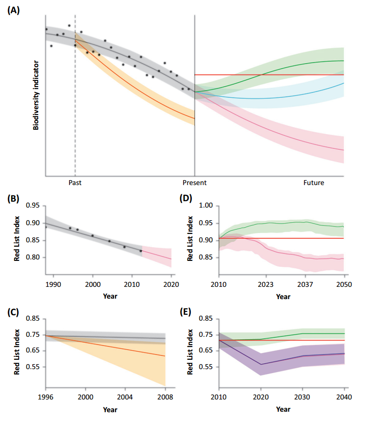
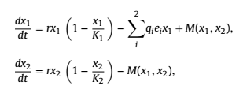
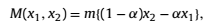
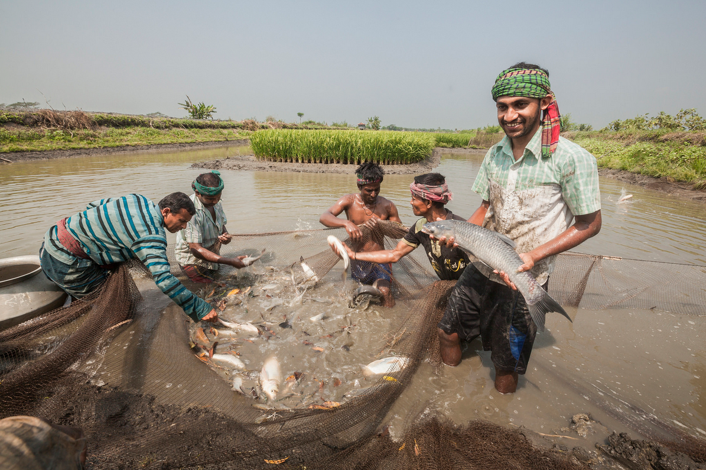

``` {r echo=FALSE}
library(knitr)
source('lgFunc.r')

```

# Overview

.left-column[
  ```{r, out.width = "90%", echo=FALSE}
include_graphics("pics/popmanage_banner1.jpg")
```
]

.right-column[

- What and why?

{{content}}

]

--

- Types of model
{{content}}

--

  + Conceptual
  {{content}}
--
  + Quantitative models
  {{content}}
--
  + Simulation models
{{content}}

--

- Examples in conservation & population management

{{content}}

--

- Tea break!

{{content}}

--

- Discussions & excercises

{{content}}

---

# Why modelling?

## What is it anyway?

### Definitions?

{{content}}
--
  "*a <span style="color:blue">representation</span> of a particular thing, idea, or <span style="color:blue">condition</span>.. can be as simple as a verbal statement about a subject, or two boxes connected by an arrow to represent <span style="color:blue">some relationship</span>.*" [(Jackson et al 2000)](https://academic.oup.com/bioscience/article/50/8/694/243278)

{{content}}

--

"*Models represent real world phenomena in <span style="color:blue">simplified forms</span> in order to <span style="color:blue">generate understanding</span> of those phenomena; in ecology, models are typically <span style="color:blue">mathematical objects</span>*" [(Evans 2012)](https://www.ncbi.nlm.nih.gov/pmc/articles/PMC3223798/)

---

# Why modelling?

## What is it anyway?

.left-column[
```{r, out.width = "90%", echo=FALSE}
include_graphics("pics/oycs_square_small.jpg")
```
```{r, out.width = "90%", echo=FALSE}

```
```{r, out.width = "90%", echo=FALSE}

```

]
.right-column[
### Examples illustrate different purposes
- **Predicting** animal distributions and/or population dynamics following disturbance or management interventions (e.g. [Stillman et al. 2001](https://besjournals.onlinelibrary.wiley.com/doi/abs/10.1046/j.1365-2664.2001.00644.x), [Nabe-Nielsen et al. 2014](http://www.sciencedirect.com/science/article/pii/S0304380013004675))
- **Evaluating** effect of policy interventions on species conservation (e.g. [Nicholson et al. 2019](https://linkinghub.elsevier.com/retrieve/pii/S0169534718302519))
- **Understanding** effect of delayed management responses (e.g. [Fryxell et al. 2010](http://www.sciencemag.org/cgi/doi/10.1126/science.1185802))
]


---

# Why modelling? Evaluation and uncertainty

.left-column[
```{r, out.width = "100%", echo=FALSE}

```
```{r, out.width = "100%", echo=FALSE}
include_graphics("pics/targets_set2.png")
```

]

.right-column[

### The Aichi Biodiversity Targets 
Convention on Biological Diversity, 
e.g...
- **Target 5**: "*By 2020, the rate of <span style="color:blue">loss of all natural habitats</span>, including forests, is <span style="color:blue">at least halved</span> and where feasible brought close to zero, and degradation and fragmentation is significantly reduced.*"
- **Target 12**: "*By 2020 the <span style="color:blue">extinction of known threatened species has been prevented</span> and their conservation status, particularly of those most in decline, has been improved and sustained.*"
]

---

# Why modelling? Evaluation and uncertainty

### Scenarios and Models to Support Global Conservation Targets ([Nicholson et al. 2019](https://linkinghub.elsevier.com/retrieve/pii/S0169534718302519))

.pull-left[
```{r, out.width = "100%", echo=FALSE}

```
]

.pull-right[
- Targets can shape policy and action...  
{{content}}
]
--
- ... **BUT** bad wording or poor understanding can lead to poor conservation outcomes
{{content}}
--
- Model <span style="color:blue">predictions may help evaluate possible outcomes</span> (scenarios)
{{content}}
--
- Facilitates systematic use of <span style="color:blue">data</span> & representation of <span style="color:blue">uncertainty</span>

---

# Why modelling? Management complexity

.pull-left[

]

--

.pull-right[
``` {r, echo=FALSE, fig.retina=3}
goose <- read.csv('~/Dropbox/Islay_goose_data_from_Tom_Jan_2018/Population counts/Barnacle_goose_Islay_monthly_counts_1987-2015.csv')
barplot(tapply(goose$mean.count, goose$year, mean), ylab='Mean winter count', 
        xlab='Year', main='Islay barnacle goose counts', col='darkgreen')
```
]

---

# Why modelling? Management complexity


---

# Why modelling? Management complexity


---

# Why modelling? Management complexity

.pull-left[
  
[The Scotsman](https://www.scotsman.com/news/environment/islay-s-barnacle-geese-battle-i-can-t-shoot-enough-to-make-a-difference-1-4831537), November 2018

]

--

.pull-right[
  
[theferret.scot](https://theferret.scot/film-geese-shot-injured-islay/), January 2019
]

---

# We're all modellers! (sort of)
--
.pull-left[
```{r echo=FALSE}
example_data <- data.frame(Obs=c(1:1000),N=rpois(1000,100))
hist(example_data$N, col='grey', ylab='', xlab='N', main='Histogram of N', cex.axis=2, cex.lab=2)
ndata <- rnorm(10000, 100, 10)
f <- 200/max(density(ndata)$y)
lines(density(ndata)$x, density(ndata)$y*f, col='red', lwd=2)
abline(v=mean(example_data$N), col='red', lwd=3, lty='dashed')
```
``` {r eval=FALSE}
N = rpois(1000, 100) # Sample counts
rnorm(10000, 100, 10) # Normal distribution
```
]
--
.pull-right[

- A mean of *N* is a model!

- Makes assumptions

- "Predicts" the most likely "true" value, given assumptions hold

]


---

# Conceptual models

.pull-left[
  
  
]
.pull-right[

- State variables  
  Represent condition/state, e.g.
  - Population size
  - Stakeholder response
  
- Relationships  
  Represent relationships or effects, e.g.
  - Effect of predation
  - Management effects
]

---

# Conceptual models

.pull-left[
  
  
]
.pull-right[

- **Advantages**

{{content}}
]
--
  + Easy to understand and to communicate
{{content}}
--
  + Very flexible and quick to develop
{{content}}
--
  + Useful tool for planning/designing work
{{content}}
--

- **Disadvantages**

{{content}}
--
  + Not usually quantitative
{{content}}
--
  + Can be deceptively simple
{{content}}


---

# Quantitative models

## Logistic population growth model

.pull-left[
``` {r echo=FALSE}
r1 <- 1.5
K1 <- 100
t1 <- seq(0,6,0.1)
N_t1 <- lgFunc(K=K1, N0=10, r=r1, t=t1)
plot(t1, N_t1, type='l', xlab='t', ylab='N', cex.axis=1.5, cex.lab=1.5, lwd=2, ylim=c(0,150))
text(x=1, y=140, paste("K =",K1), cex=2)
text(x=1, y=125, paste("r =",r1), cex=2)

```
]

.pull-right[
  
$\frac{dN}{dt}=rN\Big(1-\frac{N}{K}\Big)$

$N(t) = \frac{KN_0}{(K-N_0)e^{-rt}+N_0}$

- N(t) = population size at time *t*
- N<sub>0</sub> = initial population size
- r = intrinsic population growth rate
- K = carrying capacity

]

---

# Quantitative models

## Logistic population growth model

.pull-left[
``` {r echo=FALSE}
r1 <- 1.5
K2 <- 140
t1 <- seq(0,6,0.1)
N_t2 <- lgFunc(K=K2, N0=10, r=r1, t=t1)
plot(t1, N_t2, type='l', xlab='t', ylab='N', cex.axis=1.5, cex.lab=1.5, lwd=2, ylim=c(0,150))
text(x=1, y=140, paste("K =",K2), cex=2)
text(x=1, y=125, paste("r =",r1), cex=2)
```
]

.pull-right[
  
$\frac{dN}{dt}=rN\Big(1-\frac{N}{K}\Big)$

$N(t) = \frac{KN_0}{(K-N_0)e^{-rt}+N_0}$

- N(t) = population size at time *t*
- N<sub>0</sub> = initial population size
- r = intrinsic population growth rate
- K = carrying capacity

]

---

# Quantitative models
  
## Logistic population growth model

.pull-left[
``` {r echo=FALSE}
r2 <- 0.75
K2 <- 140
t1 <- seq(0,6,0.1)
N_t2 <- lgFunc(K=K2, N0=10, r=r2, t=t1)
plot(t1, N_t2, type='l', xlab='t', ylab='N', cex.axis=1.5, cex.lab=1.5, lwd=2, ylim=c(0,150))
text(x=1, y=140, paste("K =",K2), cex=2)
text(x=1, y=125, paste("r =",r2), cex=2)
```
]

.pull-right[
  
$\frac{dN}{dt}=rN\Big(1-\frac{N}{K}\Big)$

$N(t) = \frac{KN_0}{(K-N_0)e^{-rt}+N_0}$

- N(t) = population size at time *t*
- N<sub>0</sub> = initial population size
- r = intrinsic population growth rate
- K = carrying capacity

]

---

# Quantitative models

## Logistic population growth model

.pull-left[
``` {r echo=FALSE}
r2 <- 0.75
K2 <- 140
t1 <- seq(0,6,0.1)
N_t2 <- lgFunc(K=K2, N0=10, r=r2, t=t1)
plot(t1, N_t2, type='l', xlab='t', ylab='N', cex.axis=1.5, cex.lab=1.5, lwd=2, ylim=c(0,150))
text(x=1, y=140, paste("K =",K2), cex=2)
text(x=1, y=125, paste("r =",r2), cex=2)
```
]

.pull-right[
  
**Advantages**
{{content}}
]
--
- Basic quantitative models very simple
{{content}}
--
- Relatively easy to fit to data  
{{content}}
--

**Disadvantages**
{{content}}
--
- Simple forms not very widely applicable
{{content}}
--
- Limited extendability, at least in basic form
{{content}}
--
- N function of only one "explanatory variable"
{{content}}

---

# Quantitative models

## More realism?
Effects of noise and by-catch on a Danish harbour porpoise population (Nabe-Nielsen et al. 2014)


- Needs understanding of maths
- Not easy to communicate to non-specialists
- Usually very specific to case study

---

# Quantitative models

## More realism?
Effect of marine reserve establishment on non-cooperative fisheries management (Takashina *et al*. 2017)

.pull-left[
  
  
  
  
  
]

.pull-right[
```{r, echo = FALSE, out.width = "250px", fig.align='center'}

```

- Increased realism = increased complexity
- Hard to communicate?
- Needs extensive technical skills to implement

]

---