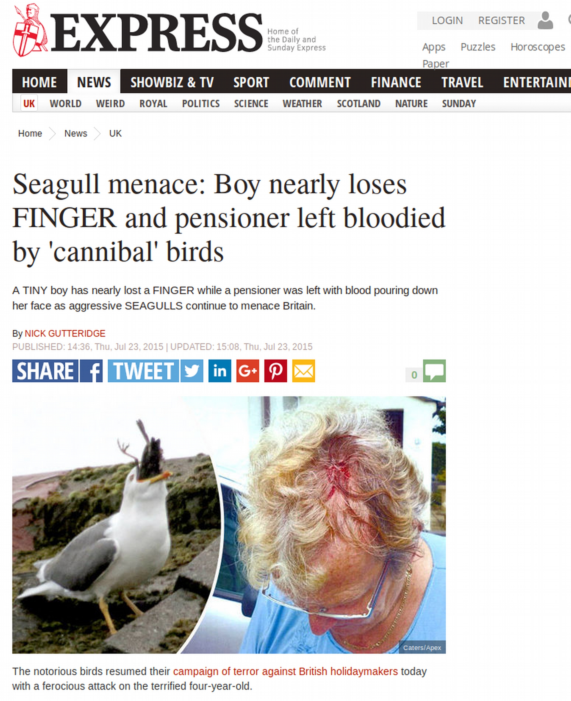
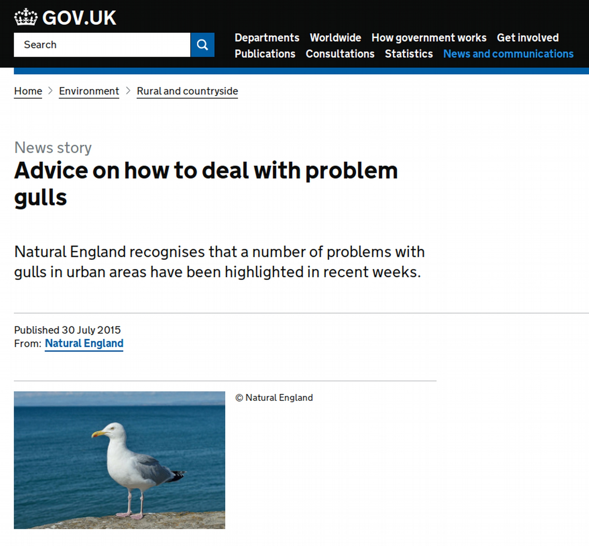
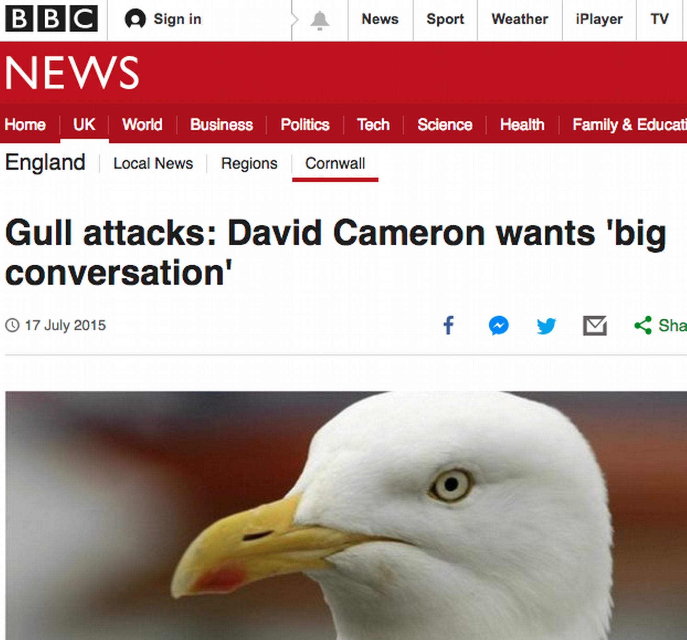
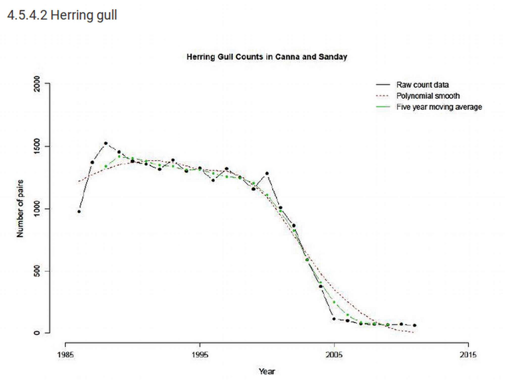
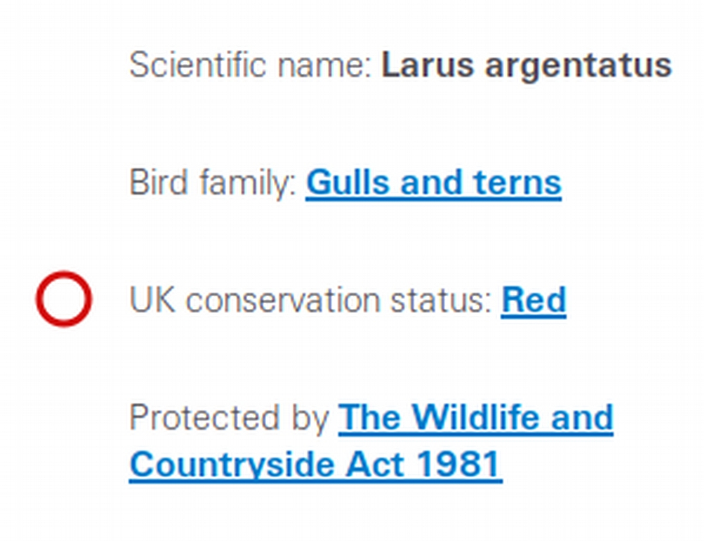
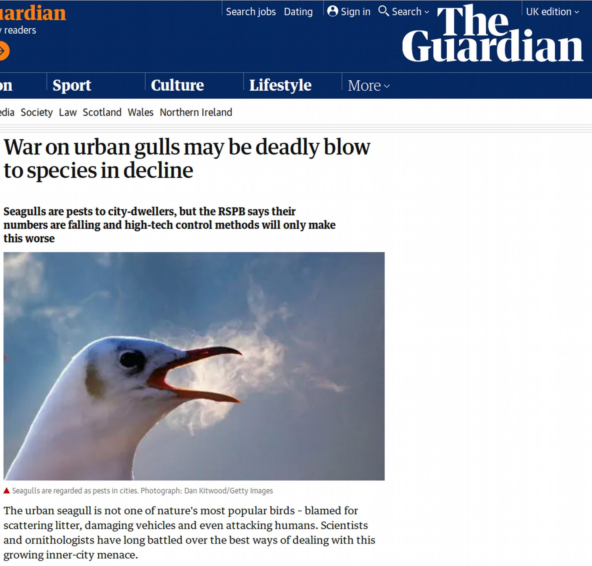
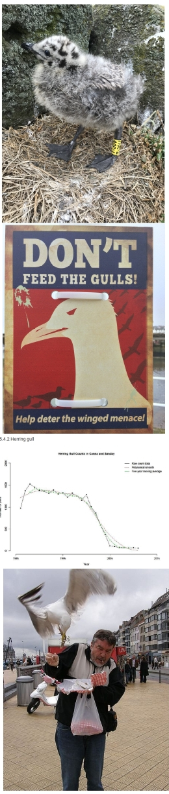

``` {r echo=FALSE}
library(knitr)
```

# The "Urban gull problem"

.pull-left[
```{r, out.width = "100%", echo=FALSE}

```
]

.pull-right[
```{r, out.width = "70%", echo=FALSE}

```
```{r, out.width = "70%", echo=FALSE}

```
]

---

# The "Urban gull problem"

.pull-left[
```{r, out.width = "100%", echo=FALSE}

```
```{r, out.width = "70%", echo=FALSE}

```
]
.pull-right[
```{r, out.width = "70%", echo=FALSE}

```
```{r, out.width = "50%", echo=FALSE}
include_graphics("pics/gull_chick.jpg")
```
]

---

# The "Urban gull problem"

## Key questions

- Population size/trends in different sites?
  + Differences between urban and marine sites?
  + Predictions? Effects?
  
- Management effects?
  + Culling efforts?
  + Deterrents?

- Socio-economic issues?

---

# The "Urban gull problem"

.left-column[
```{r, out.width = "70%", echo=FALSE}

```
]

.right-column[
### Aims:

- Develop conceptual model in groups
- Aimed at managers/conservationists
- Present/discuss to class at end

### Consider...

- Define question - could be different ones
- Consider parameters available and needed; feasibility
- Scan literature/reports

###**Be creative, I don't know the answer!**

]

---