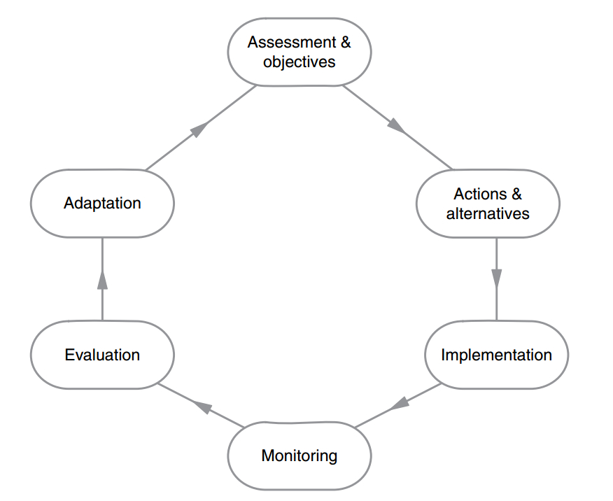

``` {r echo=FALSE}
library(knitr)
source('lgFunc.r')

```

# Overview

.left-column[
```{r, out.width = "100%", echo=FALSE, fig.align="center"}
include_graphics("pics/banner2.jpg")  
```
]
.right-column[

{{content}}
]
--
- Revisiting conservation management complexity

{{content}}
--
  - Not all animals are alike...
{{content}}
--
  - Not all humans are alike...
{{content}}
--
  - Socio-economic systems

{{content}}
--
- Need to consider stakeholders

{{content}}
--
- Management Strategy Evaluation

{{content}}
--
- GMSE, its features & methods

{{content}}
--
- Application of GMSE: goose population management


---

# Management complexity
```{r, out.width = "95%", echo=FALSE, fig.align="center"}
include_graphics("pics/basicharvest0.jpg")  
```
---

# Management complexity
```{r, out.width = "95%", echo=FALSE, fig.align="center"}
  
```
---

# Management complexity
```{r, out.width = "95%", echo=FALSE, fig.align="center"}
include_graphics("pics/basicharvest2.jpg")  
```
---

# Management complexity
```{r, out.width = "95%", echo=FALSE, fig.align="center"}
include_graphics("pics/basicharvest3.jpg")  
```
---

# Management complexity
```{r, out.width = "95%", echo=FALSE, fig.align="center"}
  
```

---
# Management complexity
```{r, out.width = "95%", echo=FALSE, fig.align="center"}
  
```

---

# Management complexity

### Simple harvest rules can lead to population collapse

.pull-left[
```{r, out.width = "100%", echo=FALSE, fig.align="center"}
include_graphics("pics/hutchings94_codpop.jpg")  
```
```{r, out.width = "100%", echo=FALSE, fig.align="center"}
  
```
]
.pull-right[
```{r, out.width = "100%", echo=FALSE, fig.align="center"}
include_graphics("https://www.thepacket.ca/media/photologue/photos/cache/TEL-A01-24032018-Cod_large.jpg")  
```
.center[
  Atlantic cod (*Gadus morhua*)
  [Hutchings & Myers 1994](https://www.nrcresearchpress.com/doi/abs/10.1139/f94-214)
  ]
]

---

# Management complexity

### Ignoring individual behaviour affects projections

.pull-left[
```{r, out.width = "80%", echo=FALSE, fig.align="center"}
include_graphics("pics/Keriberiou_Fig5.jpg")
```
]
.pull-right[
.center[
Red-billed chough (*Pyrrhocorax pyrrhocorax*)
[Kerbiriou et al 2009](http://besjournals.onlinelibrary.wiley.com/doi/abs/10.1111/j.1365-2664.2009.01646.x)
]
```{r, out.width = "50%", echo=FALSE, fig.align="center"}
include_graphics("pics/Chough.jpg")
```
```{r, out.width = "80%", echo=FALSE, fig.align="center"}
include_graphics("pics/Keriberiou_Fig4.jpg")
```

]

---

# Management in socio-economic systems

```{r, out.width = "100%", echo=FALSE, fig.align="center"}
include_graphics("pics/Ostrom_framew_2009.jpg")  
```

.center[[Ostrom (2009)](http://science.sciencemag.org/content/325/5939/419)]

---

# Management in socio-economic systems

## Consideration of **wildlife** as well as **people**

.pull-left[
```{r, out.width = "80%", echo=FALSE, fig.align="center"}

```

```{r, out.width = "80%", echo=FALSE, fig.align="center"}
include_graphics("pics/barnies.jpg")
```
]
--
.pull-right[
```{r, out.width = "80%", echo=FALSE, fig.align="center"}
include_graphics("pics/bushmeat2.jpg")
```

```{r, out.width = "80%", echo=FALSE, fig.align="center"}
include_graphics("pics/birdwatchers.jpg")
```
]

---

# Importance of stakeholders (1)

## Variation in behaviour: motivations

.pull-left[
```{r, out.width = "100%", echo=FALSE, fig.align="center"}
include_graphics("pics/williams19_F1.jpg")  
```
```{r, out.width = "100%", echo=FALSE, fig.align="center"}
  
```
]

.pull-right[
```{r, out.width = "100%", echo=FALSE, fig.align="center"}
include_graphics("pics/goosehunter.jpg")  
```
.center[
Pink-footed goose (*Anser brachyrhynchus*) hunters in Denmark
([Williams *et al.* 2019](https://doi.org/10.1007/s13280-018-1070-7))
]
]

---

# Importance of stakeholders (2)

## Variation in behaviour: compliance

.pull-left[
```{r, out.width = "100%", echo=FALSE, fig.align="center"}
include_graphics("https://ichef.bbci.co.uk/news/624/cpsprodpb/D1A2/production/_98166635_gettyimages-465169758.jpg")  
```
```{r, out.width = "100%", echo=FALSE, fig.align="center", fig.cap="Getty Images"}
include_graphics("https://ichef.bbci.co.uk/news/660/cpsprodpb/15C61/production/_98158198_gettyimages-124754995.jpg")  
```
]

.pull-right[
```{r, out.width = "100%", echo=FALSE, fig.align="center"}
  
```
<br>Illegal killing for ivory drives global decline in African elephants ([Wittemeyer *et al*. 2014](https://www.pnas.org/content/111/36/13117))
]


---

# Adaptive Management

.pull-left[
```{r, out.width = "150%", echo=FALSE, fig.align="center"}
  
```
Diagram from [Bunnefeld *et al*. (2015)](http://public.eblib.com/choice/publicfullrecord.aspx?p=4866274)

]
.pull-right[
{{content}}
]
--
- <span style="color:blue">Cyclical process</span> aimed at updating strategy based on previous results

{{content}}
--
- Consideration of stakeholder responses usually limited to purely economic drivers (e.g. fishing fleets).

{{content}}
--
- <span style="color:blue">**Individual stakeholder behaviour** rarely (if ever) included</span>


---

# Management Strategy Evaluation (MSE)

## Definition?

"*..assessing the consequences of a range of management strategies or options and presenting the results in a way that
lays bare the trade-offs in performance across a range of
management objectives*"
([Smith *et al*. 1999](https://academic.oup.com/icesjms/article/56/6/967/658156))

"*MSE uses simulation models within an adaptive framework that enables the comparison of alternative strategies in a 
virtual world under multiple (and often conflicting) objectives*"
([Bunnefeld *et al*. 2011](https://www-sciencedirect-com.ezproxy.stir.ac.uk/science/article/pii/S0169534711001339))
<br>
<br>
- Focus on <span style="color:blue">**idenfitication of trade-offs**</span> rather than "optimal" solution
- Allows decision makers to make trade-offs depending on context, preferences, etc.

---

# Management Strategy Evaluation (MSE)

## Structure

.pull-left[
```{r, out.width = "100%", echo=FALSE, fig.align="center"}
  
```
.center[Figure from [Bunnefeld et al. 2011](https://www-sciencedirect-com.ezproxy.stir.ac.uk/science/article/pii/S0169534711001339)]
]
.pull-right[
Explicitly accounts for and separates..

{{content}}
]
--
1. **Resource dynamics**

{{content}}
--
2. **Observation process**
    - Detection? Biases?

{{content}}
--
3. **Manager decisions**
    - Preference? Bias?

{{content}}
--
4. **User decisions**
    - Behaviour? Compliance?

---

# MSE key advantage: uncertainty

.footnote[
.center[
[Milner-Gulland & Rowcliffe 2007](https://global.oup.com/academic/product/conservation-and-sustainable-use-9780198530350?cc=gb&lang=en&), [Bunnefeld *et al*. 2011](https://www-sciencedirect-com.ezproxy.stir.ac.uk/science/article/pii/S0169534711001339)
]
]

.pull-left[
```{r, out.width = "100%", echo=FALSE, out.width = "100%", fig.align="center"}
include_graphics("pics/MSE_uncertain2.jpg")  
```
]
.pull-right[
**<span style="color:blue">Process</span> uncertainty**
{{content}}
]
--
- Stochasticity in natural populations
{{content}}
--
- "Error"
{{content}}
--
- What are the "correct" parameters?
{{content}}
--
- c.f. parameter estimation error, residual error


---

# MSE key advantage: uncertainty

.footnote[
.center[
[Milner-Gulland & Rowcliffe 2007](https://global.oup.com/academic/product/conservation-and-sustainable-use-9780198530350?cc=gb&lang=en&), [Bunnefeld *et al*. 2011](https://www-sciencedirect-com.ezproxy.stir.ac.uk/science/article/pii/S0169534711001339)
]
]

.pull-left[
```{r, out.width = "100%", echo=FALSE, out.width = "100%", fig.align="center"}
include_graphics("pics/MSE_uncertain3.jpg")  
```
]
.pull-right[
**<span style="color:blue">Monitoring</span> uncertainty**
{{content}}
]
--
- Irrespective of process uncertainty
{{content}}
--
- Observations naturally imperfect (poor/limited survey etc)
{{content}}
--
- Note - not accounted for in "classic" statistical population models

---

# MSE key advantage: uncertainty

.footnote[
.center[
[Milner-Gulland & Rowcliffe 2007](https://global.oup.com/academic/product/conservation-and-sustainable-use-9780198530350?cc=gb&lang=en&), [Bunnefeld *et al*. 2011](https://www-sciencedirect-com.ezproxy.stir.ac.uk/science/article/pii/S0169534711001339)
]
]

.pull-left[
```{r, out.width = "100%", echo=FALSE, out.width = "100%", fig.align="center"}
include_graphics("pics/MSE_uncertain4.jpg")  
```
]
.pull-right[
**<span style="color:blue">Structural</span> uncertainty**
{{content}}
]
--
- Lack of understanding of the "true" system
{{content}}
--
- How does it respond to changes in management/environment?
{{content}}
--
- "Model uncertainty"
{{content}}
--
- c.f. statistical model selection

---

# MSE key advantage: uncertainty

.footnote[
.center[
[Milner-Gulland & Rowcliffe 2007](https://global.oup.com/academic/product/conservation-and-sustainable-use-9780198530350?cc=gb&lang=en&), [Bunnefeld *et al*. 2011](https://www-sciencedirect-com.ezproxy.stir.ac.uk/science/article/pii/S0169534711001339)
]
]

.pull-left[
```{r, out.width = "100%", echo=FALSE, out.width = "100%", fig.align="center"}
include_graphics("pics/MSE_uncertain5.jpg")  
```
]
.pull-right[
**<span style="color:blue">Implementation</span> uncertainty**
{{content}}
]
--
- Impartial or poor implementation of management/policy
{{content}}
--
- e.g...
  - Institutional inertia
{{content}}
--
  - Limited compliance
{{content}}
--
  - Practical limits to reaching quotas

---
# GMSE: introduction

```{r, out.width = "75%", echo=FALSE, out.width = "100%", fig.align="center"}
include_graphics("pics/GMSE_www.jpg")  
```
---

# GMSE: methods

## Basic structure (1)

.pull-left[
```{r, out.width = "100%", echo=FALSE, out.width = "100%", fig.align="center"}
include_graphics("pics/GMSE_structure.jpg")  
```
]
.pull-right[
[**Duthie et al. 2018**](http://doi.wiley.com/10.1111/2041-210X.13091)

{{content}}
]
--
**1. Individual resources** on landscape "cells"
  - Births, deaths, movement between cells, interaction with landcape
 
{{content}}
--
**2. Observations of resource**
  - incl. sampling error

---

# GMSE: methods

## Basic structure (2)

.pull-left[
```{r, echo=FALSE, out.width = "90%", fig.align="center"}
include_graphics("pics/GMSE_structure.jpg")  
```
]
.pull-right[
[**Duthie et al. 2018**](http://doi.wiley.com/10.1111/2041-210X.13091)

**3. Managers**
{{content}}
]
--
- Compare observation with target
{{content}}
--
- Given constraints (maximum "budget")...
{{content}}
--
- Set costs of different actions, aiming to minimise deviation from target <br>
  *(given e.g. predicted consequences of actions)*

---

# GMSE: methods

## Basic structure (3)

.pull-left[
```{r, out.width = "100%", echo=FALSE, out.width = "100%", fig.align="center"}
include_graphics("pics/GMSE_structure.jpg")  
```
]
.pull-right[
[**Duthie et al. 2018**](http://doi.wiley.com/10.1111/2041-210X.13091)

**4. Users**

{{content}}
]
--
- Within constraints ("budget")...
{{content}}
--
- Choose action that maximises "utility" <br>
  (e.g. landscape yield, resource use)
{{content}}
--
- Current actions: cull resource, scare resource, castrate resource, 
feed resource, help resource offspring

---

# GMSE: methods

## Selecting actions: genetic algorithm

```{r, out.width = "100%", echo=FALSE, out.width = "100%", fig.align="center"}
include_graphics("pics/GMSE_genalg.jpg")  
```

Each time step:
1. Run genetic algorithm (GA) for each agent (manager and each user)
2. GA simulates "evolution by natural selection" of "population" of agent decisions
3. Highest fitness strategy chosen as agent's decision

---

# Example use of GMSE: Taiga bean goose (1)

## *Anser fabalis*

.pull-left[
```{r, out.width = "80%", echo=FALSE, fig.align="center"}
  
```
```{r, out.width = "80%", echo=FALSE, fig.align="center"}
  
```
]

.pull-right[
```{r, out.width = "80%", echo=FALSE, fig.align="center"}
  
```
```{r, out.width = "70%", echo=FALSE, fig.align="center"}
include_graphics("pics/goosehunter.jpg")  
```
]

.footnote[
<br>
<br>
[T. Heinecke, AEWA Single Species Action Planning Workshop](https://riista.fi/wp-content/uploads/2013/11/AEWA_TaigaBG_Overview_Heinicke.pdf)
]

---

# Example use of GMSE: Taiga bean goose (2)

.pull-left[
```{r, out.width = "60%", echo=FALSE, fig.align="center"}
  
```
```{r, out.width = "80%", echo=FALSE, fig.align="center"}
  
```
]

.pull-right[
**Population parameters based on [Johnson et al. (2018)](https://esajournals.onlinelibrary.wiley.com/doi/full/10.1002/eap.1659) and [AEWA (2016)](https://www.unep-aewa.org/sites/default/files/publication/ts56_issap_tbg_0.pdf)**

{{content}}
]

--
- Central population = 35000 individuals
{{content}}
--
- Mean reproductive rate ~ 0.55 = 0.275 = $\lambda$  (half of pop'n = female)
{{content}}
--
- Goose survival = 0.878, i.e. prob. of death = 1 - 0.878 = 0.122
{{content}}
--
- AEWA target for population = 70000

---

# Example use of GMSE: Taiga bean goose (3)

.pull-left[
```{r, out.width = "60%", echo=FALSE, fig.align="center"}
  
```
```{r, out.width = "80%", echo=FALSE, fig.align="center"}
  
```
]

.pull-right[
**Hypothetical management unit**

{{content}}
]
--
- 60% private (farm) land, 40% public land
{{content}}
--
- 80 individual farmers
{{content}}
--
- 100x100 unit landscape, so each farmer = 75 units
{{content}}
--
- Single goose reduces yield by 0.02% per time step

---

# Example use of GMSE: Taiga bean goose (4)

### Simulations with <span style="color:brown">**culling**</span> as only option

```{r, out.width = "80%", echo=FALSE, fig.align="center"}
  
```

---

# Example use of GMSE: Taiga bean goose (5)

### Simulations with both <span style="color:brown">**culling**</span> and <span style="color:green">**scaring**</span> as options

```{r, out.width = "75%", echo=FALSE, fig.align="center"}
  
```

---

# Summary

.left-column[
```{r, out.width = "80%", echo=FALSE, fig.align="center"}
include_graphics("pics/banner2.jpg")  
```
]
.right-column[
- Effective management of natural resources needs consideration of variation in..

{{content}}
]
--
  - .. resource behaviour
{{content}}
--
  - .. stakeholder behaviour
{{content}}
--

- MSE allows integration of uncertainty
{{content}}
--
  - Process, observation, structural, implementation

{{content}}
--
- GMSE is a flexible implementation of MSE, allowing specification of population, observation, management and user models.

